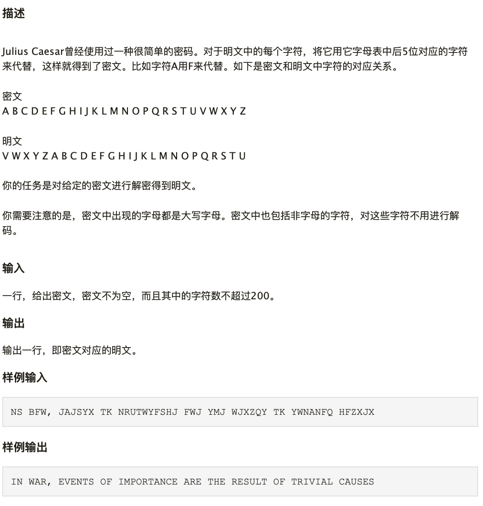

## 学习Python第四天

### 学习任务

#### 任务1. 基础知识

1. 学习Day-04的[相关知识](https://github.com/jackfrued/Python-100-Days/blob/master/Day01-15/04.循环结构.md)

#### 任务2. 完成练习

1. 完成Day4的三个练习
2. 小测试:编写程序，一张纸的厚度是0.0001米，将纸对折，对折多少次厚度超过珠峰高度8848米？ :exclamation: 提交相关代码
3. 小测试2:编写程序，解决以下问题:exclamation: 提交相关代码  

#### 鸣谢
感谢[骆昊](https://github.com/jackfrued/Python-100-Days)在Github上为我们搭建了一个学习Python的100天计划，上述任务描述以此为蓝本，再次表示感谢
